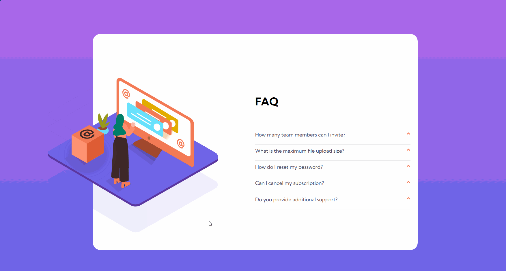

# Faq-accordion-card Component

[link](https://stalwart-dango-4f5cbe.netlify.app/)

## Purpose

To pratice how to use **JavaScript DOM** for web development

## Preview

- RWD

  
- mobile

  
- desktop

  

## Tech(no framework)

- HTML
- CSS
- JavaScript

